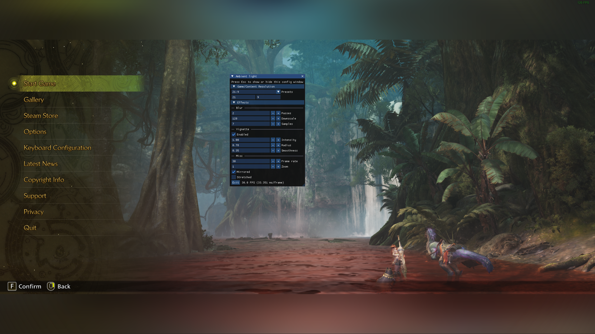

# ultrawide-ambientlight

---

This is a simple program for extending your game image into black bars (letterbox) when playing a game that doesn't support native ultrawide resolutions.

Such as:
- Fixed 16:9 aspect game on a 21:9 display
- 21:9 content on a 32:9 display
- Ultrawide content on a regular 16:9 display

Reduce risk of uneven display wear or burn-in for OLED users.

## Usage

- Start your game in borderless fullscreen game, and run ambientlight.exe
- Press ESC key to show/hide the settings window
- To exit, close the ambientlight window from your taskbar
- By default it captures an 16:9 box area of the desktop and renders in the area outside of this box

## Screenshot

## Configurations

- Resolution: Select one of the those values based on the game or content that you will be playing (FHD, QHD, WFHD, WQHD, or custom), when using custom, enter the width and height in the Custom section. For example, if you are playing a game at 1920x1080 resolution on a 2560x1080 display, set FHD.
- Adjust the Blur settings to your liking
- Adjust vignette to allow semi-transparency in the corners, this helps to let things like fps counter to be visible
- Mirror: Apply a horizontal mirroring to the effects, simulating a reflecting surface
- FrameRate: rendering frame rate of the effects

## Credits
[inipp](https://github.com/mcmtroffaes/inipp)  
[DirectXTK](https://github.com/microsoft/DirectXTK)  
[imgui](https://github.com/ocornut/imgui)  
